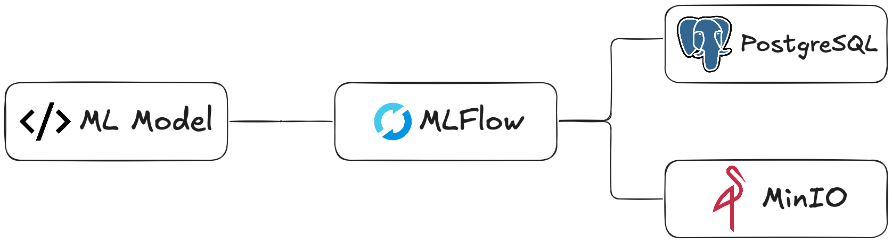

# Infrastructure

Данный репозиторий содержит образы, а также CI/CD файлы, связанные с инфраструктурными сервисами, необходимыми в рамках работы над AI Product Hack.

## Сервисы

### MLFlow

Необходим для отслеживания метрик обучения ML модели, а также быстрого получения артефактов. Для своей работы использует: MinIO (для хранения артефактов) и PostgreSQL (для хранения численных значений).

### MinIO

Необходим для корректной работы MLFlow, а также выступает в качестве объектного хранилища для изображений, отправленных администратором системы для дальнейшего дообучения модели.

