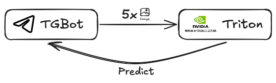

# Infrastructure

Данный репозиторий содержит образы, а также CI/CD файлы, связанные с инфраструктурными сервисами, необходимыми в рамках работы над AI Product Hack.

## Сервисы

### MLFlow

Необходим для отслеживания метрик обучения ML модели, а также быстрого получения артефактов. Для своей работы использует: MinIO (для хранения артефактов) и PostgreSQL (для хранения численных значений).


### MinIO

Необходим для корректной работы MLFlow, а также выступает в качестве объектного хранилища для изображений, отправленных администратором системы для дальнейшего дообучения модели.


### Triton

Необходим для обработки запросов пользователя к моделе, доступен через gRPC или HTTP.



## Как запустить?

Для запуска MLFlow и MinIO необходимо выполнить следующую команду на виртуальном сервере:

```bash
docker compose -f infrastructure/docker-compose.yml up -d
```

При этом необходимо, чтобы переменные окружения MINIO_USER, MINIO_PASSWORD, POSTGRES_USER, POSTGRES_PASSWORD, были определены

Для запуска Triton необходимо:
1. Добавить `model.onnx` файл по пути `/triton/models/ResNet/1`
2. Выполнить следующую команду:
    ```bash
    docker run --gpus=all -it --shm-size=256m --rm -p8000:8000 -p8001:8001 -p8002:8002 -v ./infrastructure/triton/models:/models nvcr.io/nvidia/tritonserver:24.08-py3
    ```
3. Доустановить необходимые пакеты:
    ```bash
    pip install torch torchvision
4. Выполнить команду:
    ```bash
    tritonserver --model-repository=/models
    ```

Далее тритон-сервер доступен по 8000 порту для HTTP запросов.
