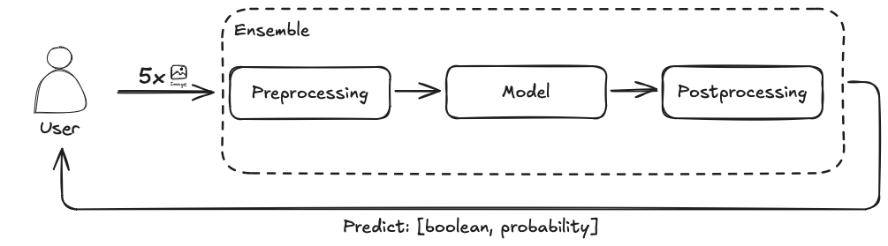
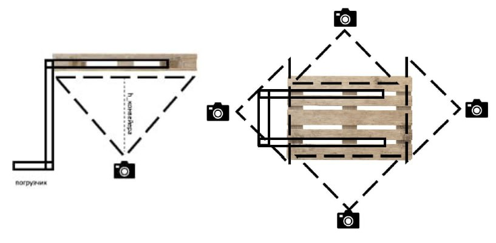

# Triton

Данная папка содержит необходимые конфигурации и вспомогательные файлы для работы тритон-сервера, обрабатывающего запросы к моделе.

К данному серверу обращается Telegram-бот, из которого отправляются 5 изображений палетта, снятого с разных ракурсов:

Ответом тритон-сервера является пара: [predict: boolean, probability: float], где первое значение означает сломан ли паллет, в то время как второй вероятность, с которой он неисправен.
